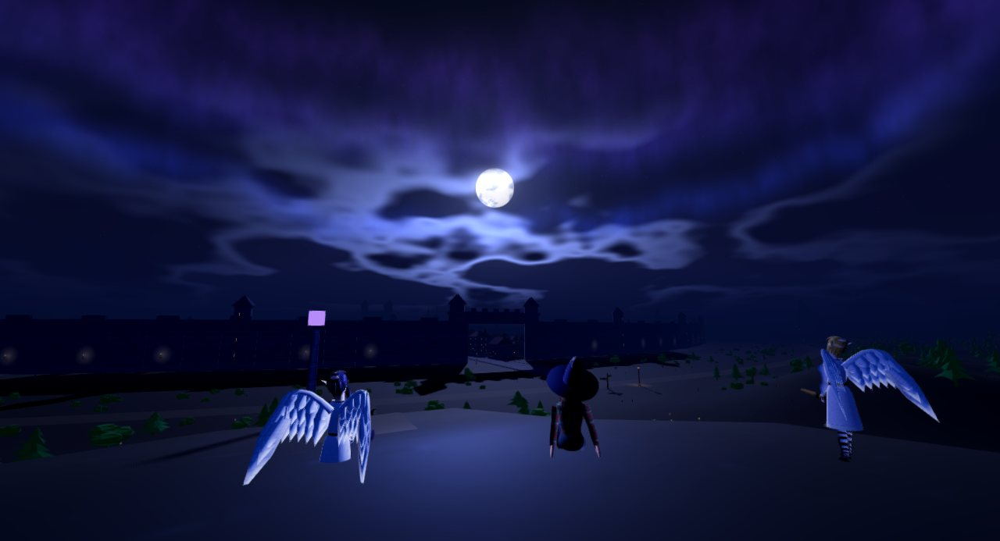
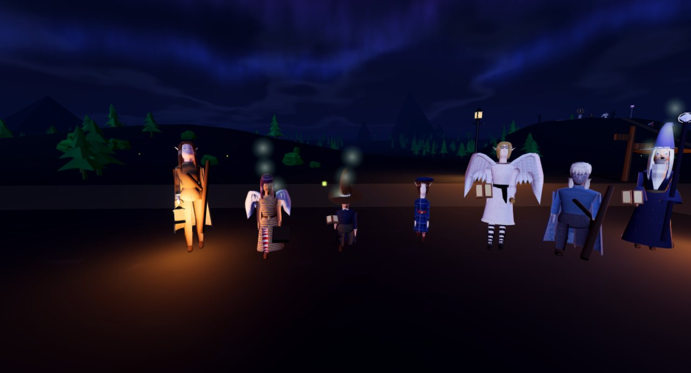
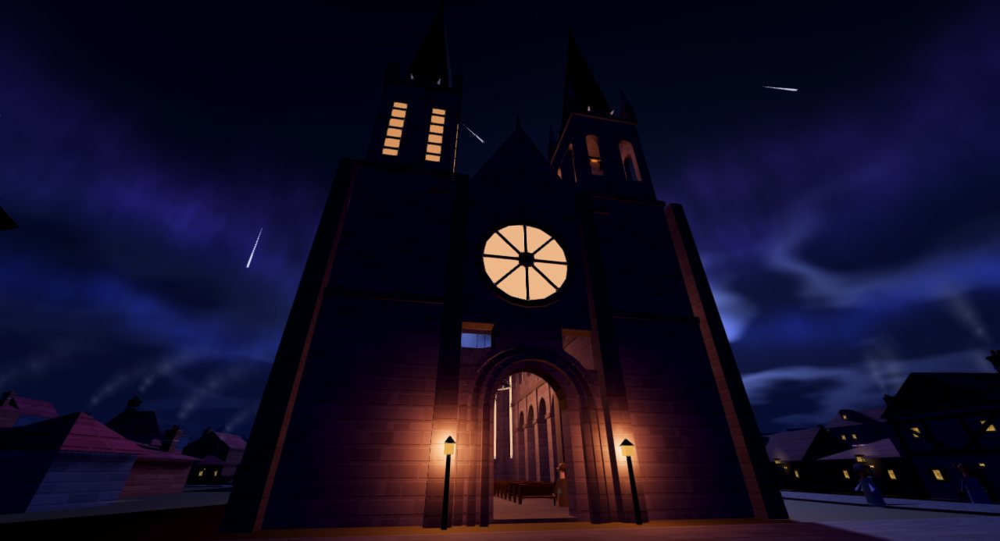
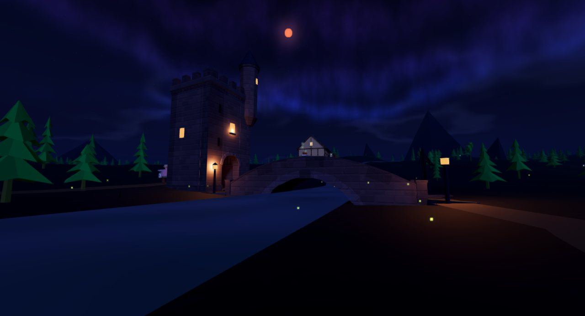
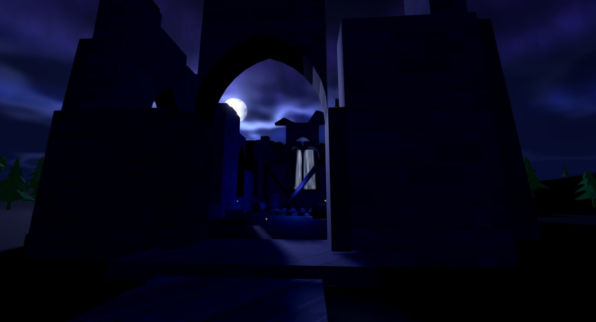

# Emberwatch

**A first-person dark-fantasy city at night that is also a live Bluetooth
controller for a Puffco Peak Pro and a Dr. Dabber Switch 2.**

You walk Vaneth, a walled black city under a cobalt sky: its wards and
avenues, markets, a cathedral whose bells turn the watches, taverns and guild
halls you can walk into, and the woods, ruins and lookouts beyond the wall.
Its people keep shops, go home for the still hours, talk, mourn, and watch the
moon. The device is not a gimmick on top: the heater's real state drives the
lighting, the spell colour and the in-game session, and the game can start and
stop a real heat cycle.



| | |
|---|---|
|  |  |
|  |  |

## Play it

- **Any revision, in a browser:** every revision is a
  [release](../../releases) with the game attached as one `.html` file.
  Download it and open it in Chrome or Edge. The latest is
  [r167 — Knight and wizard](../../releases/latest).
- **Installed, with the device panel:** the newest release also carries the
  Windows desktop app — `Emberwatch-<version>-setup.exe` (an installer) and
  `Emberwatch-<version>-portable.exe`. Chrome can also connect to devices
  from the downloaded HTML on supported systems. The desktop app provides
  its own device chooser and, since r160, Bluetooth pairing prompts.
  Installing a newer version over an older one keeps your save: every version
  is the same app, with the same data folder. The builds are unsigned, so
  Windows will ask before running them.
- **From the source:**

  ```bash
  cd app
  npm install
  npm start
  ```

Every time a revision is sealed, its release appears here on its own: run
`node releases/build-notes.js` and push, and the workflow publishes the tag,
the release, its notes and the installer.

## What is in it

- **Vaneth** — six districts and 98 authored buildings within the wall, the
  inner city filled in around them, four avenues lit at night, the Cinder
  Market, the Cathedral of Hours with a bell tower you can climb, fifteen
  halls (archives, guild halls, taverns, a shrine, a chapel) each fitted out
  by hand, and 58 homes you can walk into. Beyond the wall: forest, a river
  and its bridge, the Fallen Hall under the falls, the Oathfield, the Rain
  Oath causeway, the Lantern Grove, the Skywatch knoll.
- **The people** — 374 residents. Since r159 each is built from a kit of
  modelled, patterned parts (tartans, knit, striped stockings, painted faces,
  hats and hair) with a look of their own, after PS2/Xbox-era RPG references.
  They keep shops (143 of them), walk errands, go home in the still hours, sit,
  crouch at the hearth, sleep; place-bound characters keep watch at the
  reference places.
- **Night** — physically based lighting, bloom, weather and rare sky events,
  and a procedural sound system (bells first).
- **The devices** — the Puffco Peak Pro over the Lorax protocol, and the
  Dr. Dabber Switch 2, reverse engineered from its own frames. The game sends
  the Switch two frames and nothing else: `b1`, and `b9`, rebuilt each time
  from the settings the device itself last reported. Its other write opcodes
  change stored state, and one is a factory reset (`PROJECT.md` §5).
- **The strain journal** — a personal journal, a terpene codex and a smoke-note
  archive with autocomplete.
- **Six variants** (`variants/`) — the same city read as a session clock, a
  temperature dial, a commission ledger, a night of combat, a survival game,
  and a bare tech demo.

## How it is built

- **One HTML file.** `app/renderer/index.html` (about 5 MB at r159) is the whole
  game: three.js r186 inlined, no build step, no modules. The engine block is
  generated by `tools/build-three.js` and never edited by hand.
- **Models from scripts.** The city is built at load from its plan; landmarks,
  interiors and furniture are modelled in Blender from Python
  (`tools/assets/`), packed and inlined into the file as glTF. The residents are built at load from the NPC kit in the file itself.
- **Electron desktop shell.** `app/main.js` registers a secure `app://`
  scheme with a stable origin and fetch/CORS support, and supplies Bluetooth
  discovery and pairing prompts. A local HTML file in Chrome can also use
  Web Bluetooth; browser, OS and adapter support still matter.
- **Verified at runtime.** Static audits (`tools/check-parse.js`,
  `audit-source.js`, `audit-dom.js`, `audit-dead.js`, `audit-comments.js`,
  the Switch frame tests) run before and after every change, and
  `tools/harness` boots the game in Electron, runs a probe inside it and takes
  screenshots, because a file that parses can still be broken.

## The repository

    app/          the desktop app; app/renderer/index.html is the game
    revisions/    every archived revision, in five phases — the history
    releases/     the release manifest, the patch notes, and the scripts that
                  publish them
    variants/     six alternate editions and the builder that makes them
    tools/        audits, the harness and its probes, the asset scripts
    docs/         the device protocol writeups, and these screenshots
    snapshots/    the first loose builds, 2026-08-17
    PROJECT.md    the full rundown: architecture, conventions, the traps, how
                  to ship — read §0 first
    CATALOG.md    the folder map and the per-revision timeline
    CHANGELOG.md  every revision's patch notes, newest first
    NIGHT-LOG.md  the log of unattended work

## History

| phase | revisions | dates (2026) | what it was |
|---|---|---|---|
| 1 | r04–r19 | Aug 17–18 | the Puffco Bluetooth panel — Lorax, auth, reconnect, profiles |
| 2 | r20–r35 | Aug 18–19 | Vaneth, and the strain archive |
| 3 | r36–r52 | Aug 19–20 | residents you can talk to, collision, the city compiler |
| 4 | r53–r69 | Aug 20–21 | streets, crowds, the inner city, Electron |
| 5 | r70–r167 | Aug 31 – Oct 3 | world depth: districts, interiors, beyond the wall, physical light, the reference places, sound, the forest, the halls, the people |

Every revision that survives — 155 of them, r04 to r167 — is published as a
tag and a release with its game file and patch notes (`CHANGELOG.md` has them all
in one place). The repository itself begins at r139; the revisions before it
lived only as files, so each tag points at a commit made for it from the
archive: that revision's game file and its patch notes, dated on the day the
record gives (the time within the day is only there to keep the order). Compare
any two tags on GitHub to see what changed between them. A few revisions were
never archived (r01–r03, r54, r59, r87, r89–r92, r102, r136, r138) and are not
there.

## Working on it

Read `CLAUDE.md`, then `PROJECT.md` §0 and §3, before changing anything. The
rules that matter most: never edit the engine block by hand; never delete or
overwrite an archived revision; run the audits before and after; verify in
the harness, with screenshots, not by reading the code; and the game writes
nothing to the Switch but `b9` and `b1`.

When a revision is sealed, `node releases/build-notes.js` adds it to the
manifest and the changelog, and pushing that publishes its tag and release
(`.github/workflows/publish-revisions.yml`).
